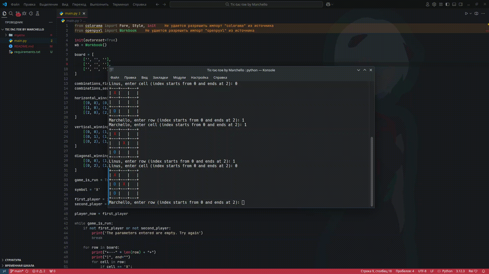

Tic-Tac-Toe is a classic two-player strategy game where players take turns marking spaces on a grid, aiming to form a winning sequence. 

-------
# Features:

1. **Game Statistics**: Using the `openpyxl` module, the winners' and losers' names are saved in an Excel file (Statistics.xlsx).


2. **Colored Move Display**: Using the `colorama` module, player symbols ("X" and "O") are displayed in different colors, improving the game's visual appeal in the console. 
```python 
for row in board:
    print("+---" * len(row) + "+")  
    print("|", end="")  
    for cell in row:
        if cell == 'X':
            print(f" {Fore.RED}{cell}{Style.RESET_ALL} |", end="")  
        elif cell == 'O':
            print(f" {Fore.BLUE}{cell}{Style.RESET_ALL} |", end="")  
        else:
            print("   |", end="")  
    print()  
print("+---" * len(board[0]) + "+")  
```

# How to start?
1. Clone the repository
    ``` bash
    git clone https://github.com/Marchello-Projects/Tic-tac-toe_by_Marchello.git
    ```
2. Create a virtual environment and install dependencies
    ## Linux/Mac:
    ``` bash
    python3 -m venv myenv
    source myenv/bin/activate
    pip install -r requirements.txt
    ```
    ## Windows:
    ``` powershell
    python3 -m venv myenv
    myenv\Scripts\activate
    pip install -r requirements.txt
    ```
3. Run the game
    ```
    python main.py
    ```
4. Deactivate the virtual environment
    ``` 
    deactivate
    ```